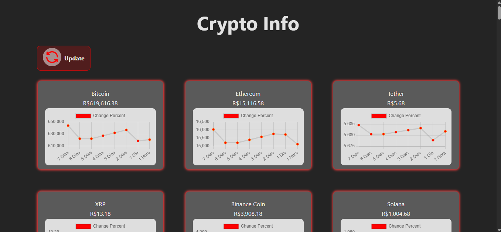

# 💰 Crypto Info\*\*

A simple and modern React app that displays real-time information about a cryptocurrency, including its current value, percentage change, and a graph of recent price movements.



**## 🚀 Features**

- 📈 Line chart of recent price history using `chart.js`
- 🔄 Live price and percentage change
- 🎨 Clean and responsive card UI
- ⚡ Built with Vite for fast development and builds
- 📦 Deployable to Netlify with ease

**## 🛠️ Tech Stack**

- \***\*React 19\*\*** for building the UI
- \***\*Vite\*\*** as the build tool
- \***\*Chart.js\*\*** and `react-chartjs-2` for rendering price graphs
- \***\*dotenv\*\*** for managing environment variables
- \***\*Netlify CLI\*\*** for local testing and deployment
- \***\*ESLint\*\*** for code linting

## API USED

https://www.coinlore.com/cryptocurrency-data-api#global

**## ⚙️ DOT ENV VARIABLES**

```
VITE_CRYPTO_API_KEY=your_api_key_here
Make sure your API supports CORS if calling from the browser.
```

**## 📦 Installation**

```bash
# Clone the repo
git clone https://github.com/yourusername/crypto-info.git
cd crypto-info

# Install dependencies
npm install
```

**## 🔧 Usage**

```bash
# Development
npm run dev
```

```bash
# Build for production
npm run build
```
